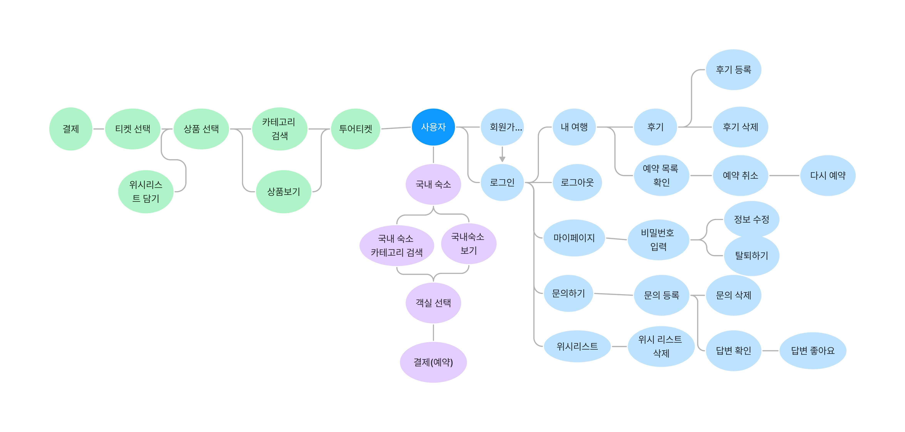

# UsWayTrip🌍

**1. 프로젝트 목표 및 요구사항** 

   ‘마이리얼트립’을 벤치마킹하여 설계된 여행사 관련 홈페이지
  
**2. 진행 기간** 

  2022.11.15 ~ 2022.12.09
  
**3. 주요 개발자원 (S/W)**
<table border="1">
		<tr>
			<th>구 분</th>
			<th>용 도</th>
			<th>명칭 및 버전</th>
		</tr>
		<tr align="center">
			<td>OS</td>
			<td>개발 PC</td>
			<td>Windows 10</td>
		</tr>
		<tr align="center">
			<td>WAS</td>
			<td>WEB/WAS</td>
			<td>Apach Tomcat 9</td>
		</tr>
		<tr align="center">
			<td>미들웨어</td>
			<td>DB</td>
			<td>OracleXE</td>
		</tr>
		<tr align="center">
			<td rowspan="3">사용 언어</td>
			<td>백 앤드</td>
			<td>java jdk 1.8 , jsp/servlet 3.1</td>
		</tr>
		<tr align="center">
			<td>개발 프레임 워크</td>
			<td>spring framework 5.0.2 , Spring Boot 2.7.7</td>
		</tr>
		<tr align="center">
			<td>프론트 앤드</td>
			<td>HTML5 , CSS3 , JAVASCRIPT, JAVA</td>
		</tr>
		<tr align="center">
			<td rowspan="2">소프트웨어 개발도구</td>
			<td>개발도구</td>
			<td>STS</td>
		</tr>
		<tr align="center">
			<td>DB</td>
			<td>SQLD</td>
		</tr>
		<tr align="center">
			<td>형상 관리및 협업</td>
			<td>소스 관리 및 버전관리</td>
			<td>Git hub , Git</td>
		</tr>
		<tr align="center">
			<td rowspan="13">사용 라이브러리 및 API</td>
			<td>관리</td>
			<td>Maven</td>
		</tr>
		<tr align="center">
			<td>db</td>
			<td>Mybatis-3.5.3</td>
		</tr>
		<tr align="center">
			<td>로그</td>
			<td>Spring AOP , Log4j</td>
		</tr>
		<tr align="center">
			<td>디자인</td>
			<td>Bootstrap , JQuery UI</td>
		</tr>
		<tr align="center">
			<td>보안</td>
			<td>Spring Security-5.0.8</td>
		</tr>
		<tr align="center">
			<td>데이터 전송</td>
			<td>Ajax</td>
		</tr>
		<tr align="center">
			<td>화면 UI</td>
			<td>JQuery-3.5.2</td>
		</tr>
	</table>
  
**4. 담당 기능**
  * Earth Way Trip DB 명세서 관련 참고 자료 작성 
  * 국내 숙소 관리 기능 구현
    * 숙소 CRUD
    * 숙소에 해당하는 객실 CRUD
    * 객실에 해당하는 객실 옵션 CRUD
  * 숙소 필터 (인원, 숙소 종류, 별점 등) 검색 기능 구현
  * 페이지네이션 기능 구현
  
**5. 느낀 점**  

* 어려웠던 점  
📌 숙소 등록 과정에서의 다중 사진 업로드에 대한 어려움을 겪었다.  
✔ 다중 파일 업로드 기능 구현과 관련된 코드에 대한 이해, 그리고 업로드 관련 클래스를 설계하여(단일 파일 업로드, 다중 파일 업로드) 재사용이 가능하도록 하였다.   
📌 필터링(인원, 숙소, 별점 등)과 페이지 처리 관련된 기능 구현에 어려움을 겪었다.  
✔  SQL 문의 심층적 활용(여러 개의 테이블 조인, 조건문 등)을 통하여 데이터를 가져오고, 페이징 클래스를 설계하여 페이징네이션을 구현하였다.  

* 배운 점  
💡 Table 관계에 대한 이해 및 SQL 문 관련 역량(5개 이상의 테이블 조인 등)  
💡 요구사항과 관계에 근거하여 DB를 설계하는 능력  
💡 관리자와 사용자의 UI, 기능 분리  
💡 협업에서 중요한 팀워크, 의사소통능력, 문제해결 능력  

**6. 관련 이미지**  
* 사용자 흐름도

* 관리자 흐름도

* 국내숙소 관리자 시연 

* 국내숙소 사용자 시연 

